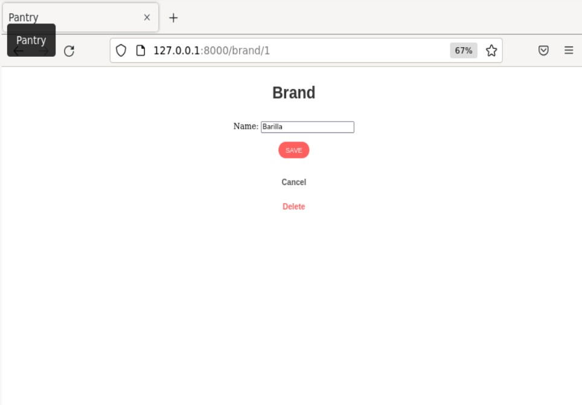

# H4
## Pantry  
## Appissa pystyy lisäämään Pantryyn eli ruokavarastoon tuotteita ja sekä niiden merkkejä.
### Ruokavaraston tuotteiden etusivu. Uuden tuotteen pystyy lisäämään listan alapuolelta

### Tällä sivulla voi lisätä uuden tuotteen tai poistua sivulta, jos tahtoo Cancel-napin kautta

### Listalla tuotteen nimeä klikkaamalla pääsee editoimaan tuotteen tietoja tai menemään takaisin listaukseen, jos näin käyttäjä tahtoo. Tuotteen voi myös poistaa editointi sivulta

### Tuotelistan alapuolelta pääsi Brands in the Pantry-nappia painamalla tutustumaan listaan merkeistä/brändeistä mitä varastossa saattaa olla. Brändin voi myös poistaa brändin nimen oikealta puolelta. (Tässä oli tälläinen pieni kokeilu)

### Brändejä voi lisätä,muokata ja poistaa samalla tavalla kuten tuotteita pystyi. 

